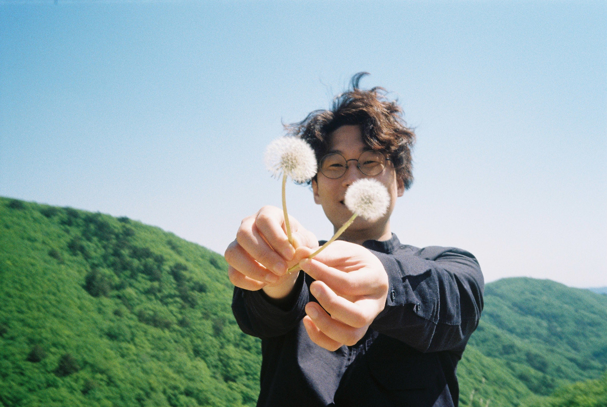
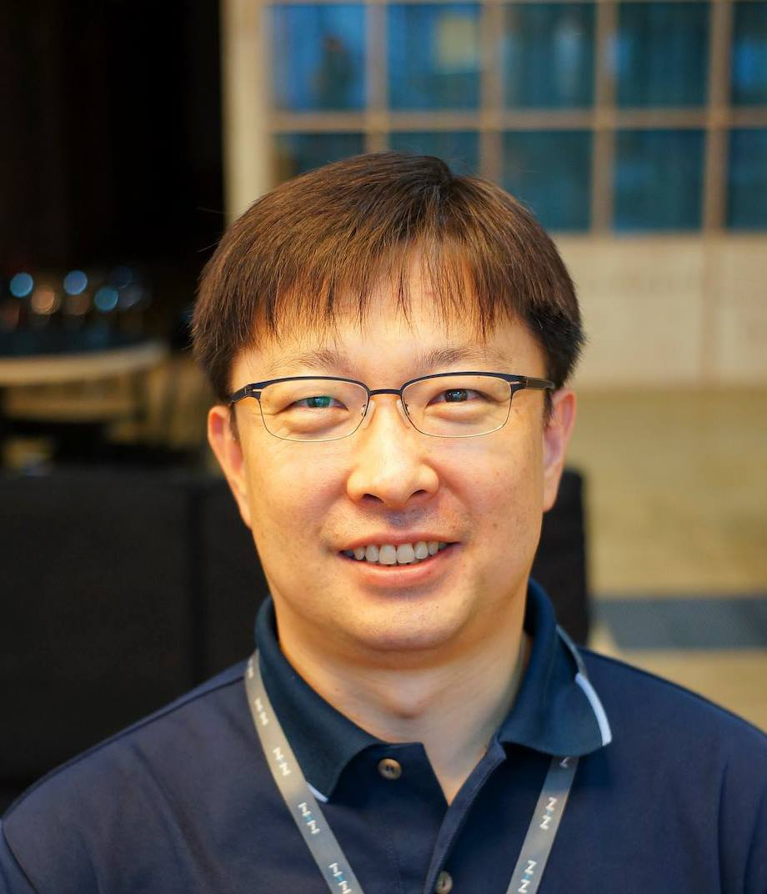
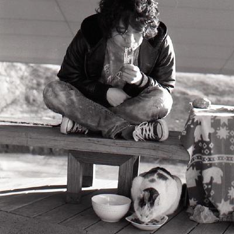
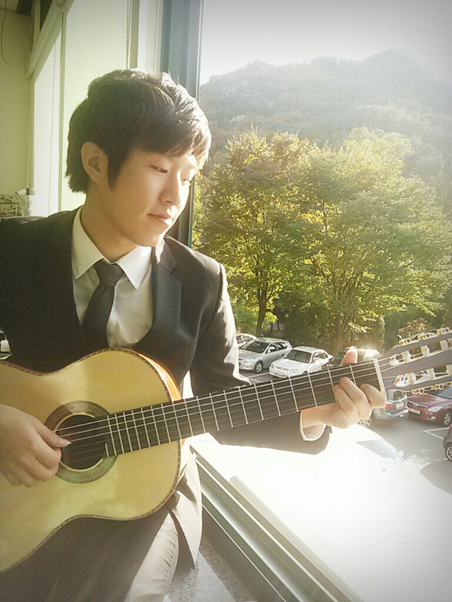
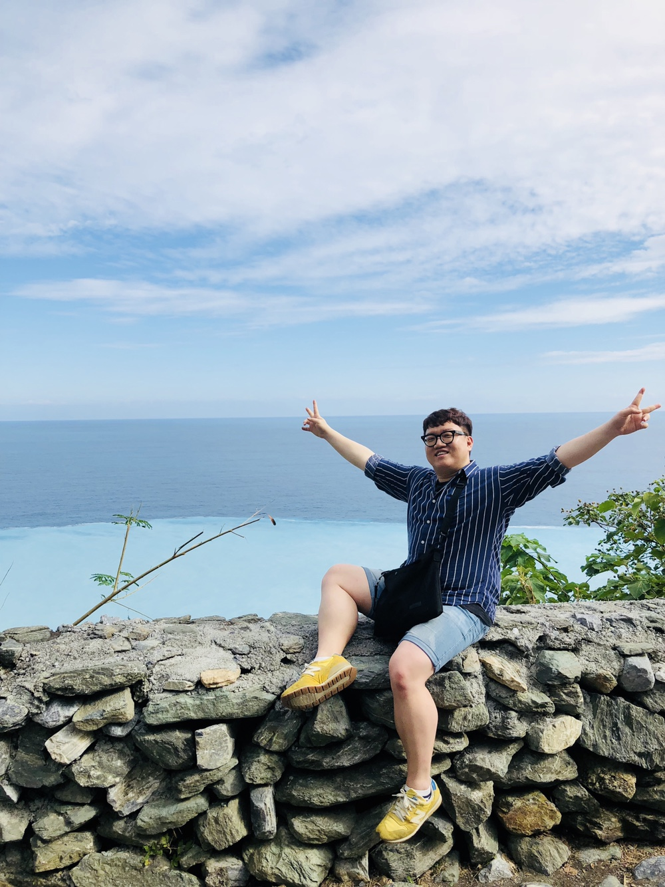
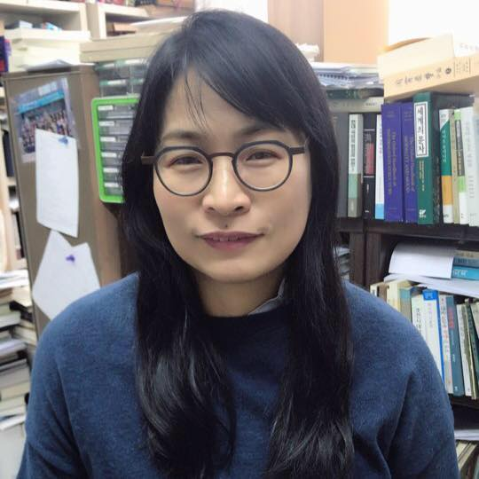
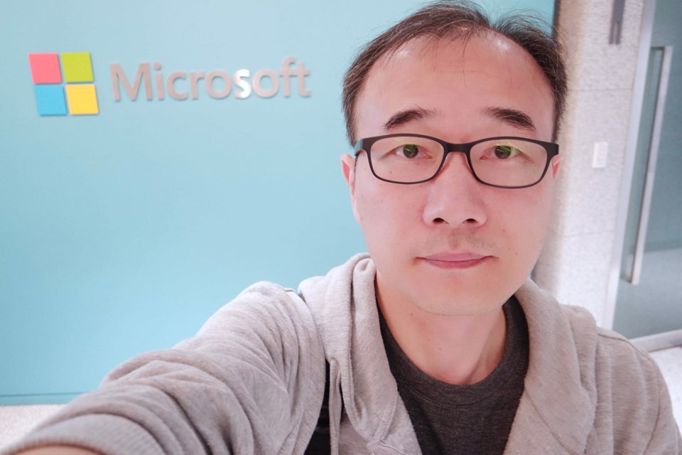
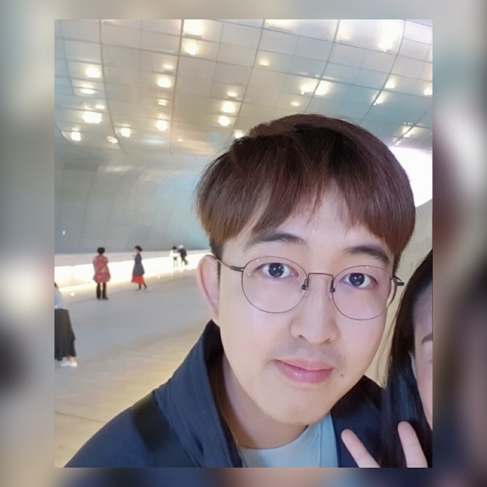
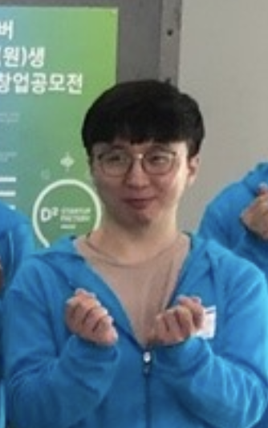

"제목"을 클릭하시면 발표 자료를 보실 수 있습니다.
    

|번호|발표 유형|이름|소속|제목|발표 소개|
|:---:|:-----------------:|:-----------:|:--------:|:--------:|:--------------:|
|1|키노트|박상원|DeepNatural AI|고품질 코퍼스를 만들어 드립니다.|-|   
|3|키노트|김준석|현대차  AIR랩|자동차 만드는 회사에서 필요한 NLP|-|    
|1|스피커|김현중|네이버|KoNLPy 를 이용하여 Huggingface Transformers 학습하기|Huggingface tokenizers 외 다른 기학습된 토크나이저를 이용하여 Transformers 모델을 학습하고, 사전방식의 토크나이저와 word piece 기반 토크나이저의 차이를 살펴봅니다.|   
|4|스피커|조원익|서울대학교 전기정보공학부|화행, 그 이론과 데이터 구축의 간극|화행은 종종 의도와 혼용되지만, 산업보다는 언어학적 측면에서 주로 다루어집니다. 본 발표에서는, 기존 화행 이론의 유형화 방식이 추구하는 바를 화용, 의미 및 통사론의 시각에서 바라보고, 이것이 실제로 산업에서 사용될 수 있는 의도 파악 데이터의 구축에 어떻게 활용될 수 있는지 알아보려 합니다.|  
|5|스피커|송치성|NCSOFT|Spoken Language Understanding 101| - 최근 스마트폰, 스마트 스피커, 스마트 TV, 자동차 내비게이션 등에 접목된 음성 인터페이스는 우리 생활을 편하게 만들어주고 있습니다.그런데 이러한 컴퓨터 시스템은 어떻게 우리의 말소리를 듣고 이해 하고 반응할 수 있을까요? 본 발표에서는 이러한 음성 인터페이스를 통해 컴퓨터 시스템이 사용자의 발화를 이해할수 있도록 하는 음성언어이해(SLU; Spoken Language Understanding) 기술에 대해 소개합니다. 그리고 최근 주목받고 있는 End-to-end 접근 방식의 SLU 아키텍처에 대해서도 알아봅니다.|   
|1|튜토리얼|현청천|헬로엔엠에스|Transformer 구현하기|Transformer는 가장 기본이 되는 모델입니다. NLP를 하시는 분이라면 꼭 봐야하고 깊게 이해할 필요가 있다고 생각됩니다. GPT, BERT등 다양한 모델이 Transformer를 기반으로 작성된 모델입니다. Transformer를 직접 구현해 보는 과정을 통해 더 깊이 이해하는 것이 목표입니다.(고급)|    
|1|포스터발표|최민주|-|[관용구 기계번역을 위한 한-영 데이터셋 구축 및 평가 방법](./data/translate.pdf)|관용구는 둘 이상의 단어가 결합하여 특정한 뜻을 생성한 어구로 기계번역 시 종종 오역이 발생한다. 이는 관용구가 지닌 함축적인 의미를 정확하게 번역할 수 없는 기계번역의 한계를 드러낸다. 따라서 신경망 기계 번역(Neural Machine Translation)에서 관용구를 효과적으로 학습하고 번역 결과를 평가하려면 관용구에 특화된 번역 쌍 데이터셋과 평가방법이 필요하다. 본 논문에서는 관용구 기계번역을 위한 한-영 번역 쌍 데이터셋을 구축하는 방법과 관용구 번역 결과를 평가하기 위해 블랙리스트를 구축하는 방법을 제안한다. 본 발표는 최근 KCC2020에서 발표한 논문입니다. 논문 내용 잘 정리하여 발표 준비하려 합니다.|    

# 행사 진행

|:--------:|:-----------------:|:-----------:|:--------:|
|송영숙|송치성||이재석|이상열|
|박신홍|송진영)     

