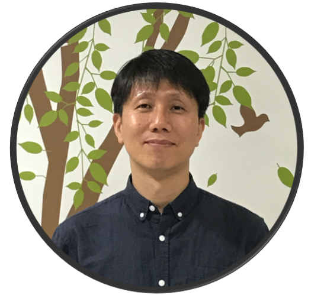

"제목"을 클릭하시면 발표 자료를 보실 수 있습니다.
    

|번호|발표 유형|이름|소속|제목|발표 소개|
|:---:|:-----------------:|:-----------:|:--------:|:--------:|:--------------:|
|1|키노트|박상원|DeepNatural AI|고품질 코퍼스를 만들어 드립니다.|-|   
|3|키노트|김준석|현대차  AIR랩|자동차 만드는 회사에서 필요한 NLP|-|    
|1|스피커|김현중|시간에 따른 뉴스의 토픽 변화 시각화 (중급)|-|          
|4|스피커|조원익|서울대학교 전기정보공학부|화행, 그 이론과 데이터 구축의 간극|화행은 종종 의도와 혼용되지만, 산업보다는 언어학적 측면에서 주로 다루어집니다. 본 발표에서는, 기존 화행 이론의 유형화 방식이 추구하는 바를 화용, 의미 및 통사론의 시각에서 바라보고, 이것이 실제로 산업에서 사용될 수 있는 의도 파악 데이터의 구축에 어떻게 활용될 수 있는지 알아보려 합니다.|  
|5|스피커|송치성|NCsoft||"Spoken Language Understanding"의 시작(초중급)|-|             
|1|튜토리얼5|현청천|헬로엔엠에스|Transformer & BERT 구현하기|Transformer는 가장 기본이 되는 모델입니다. NLP를 하시는 분이라면 꼭 봐야하고 깊게 이해할 필요가 있다고 생각됩니다. BERT는 Transformer Encoder를 사용한 모델입니다. BERT는 현재 NLP의 표준모델이라고 봐도 무방합니다. BERT는 발표 된지 1년이 지난 현재 까지도 다양한 시도를 통해 개선되고 발전되고 있는 모델입니다. 이 두 모델을 가장 작은 형태로 구현해 보는 과정을 통해 더 깊이 이해하는 것이 목표입니다.(고급)|        

# 행사 진행

|:--------:|:-----------------:|:-----------:|:--------:|
|송영숙|송치성||이재석|     

