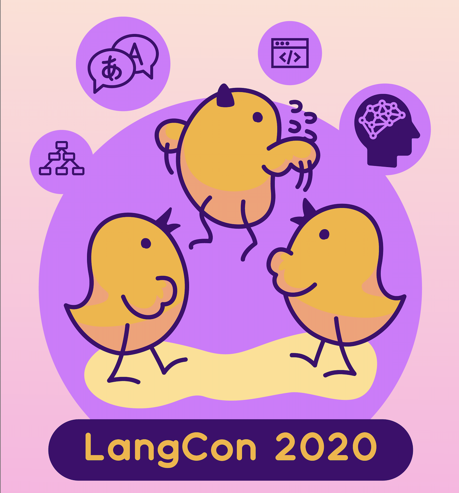

---
# Feel free to add content and custom Front Matter to this file.
# To modify the layout, see https://jekyllrb.com/docs/themes/#overriding-theme-defaults

layout: home
---

# 2020년 8월 29(목) Langcon2020On&Off

 

      

                            
                       
                            

# 대회는 Zoom.us 와 Youtube를 통해 공개됩니다.
신청하신 분들께 메일을 통해 Zoom 링크를 보내 드리겠습니다.

# 지난 대회 보기          
[멜팅팡_연합세미나](https://www.onoffmix.com/event/110570)                   
[사람이 챗봇을 만듭니다!](https://www.onoffmix.com/event/124842)            
 >[발표 동영상](https://www.youtube.com/playlist?list=PLqkITFr6P-oRQu0OJCIqHuff-ubbCkWlL)                   

[봇봇봇](https://www.onoffmix.com/event/89407)          
[Langcon2019](https://songys.github.io/2019LangCon/)

# 후원                       

[Open UP](https://www.oss.kr/)            

                         
                
[위키북스](http://wikibook.co.kr/)                             
                         
                                        

